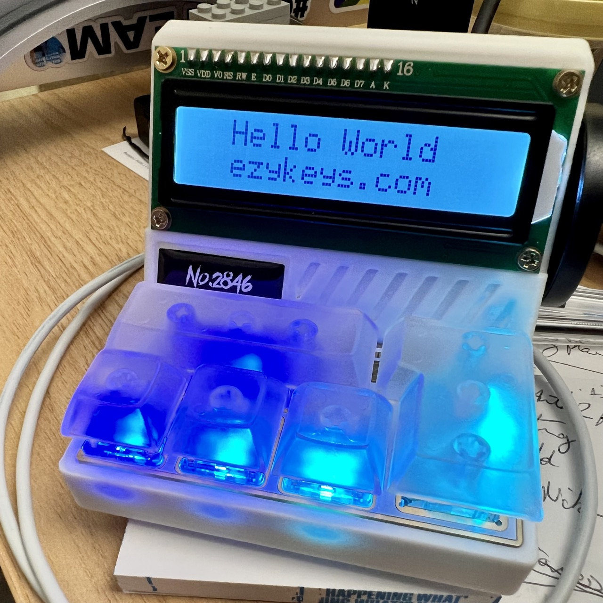

# ezykeys-mac-setup

Notes and scripts for the [Ezykeys No 2846 kit](https://ezykeys.com/) - a 5-key RGB-lit keypad based on a WCH CH552 chip, with 2 x 20 char 1620 LCD display and rotary dial

- no 2846
- Frankenstein MK5

## what is here

- several [images](img/) of my keypad
- code: [JavaScript](js/) (link to another [project]((https://github.com/RediPanda/Redi-No2846-Driver))), [Python](python/), [Swift](swift/) (to come...?)
- default [Vial configuration](2846-default.vil)
- notes on [figuring out the hardware](mk5-2846.md)
- stuff I learned about the (Windows-only) [software](win-sw.md)
- various [ideas](ideas.md) for things we could do in the future...

## references

This is a useful project: [Redi-No2846-Driver](https://github.com/RediPanda/Redi-No2846-Driver)

## license

released under the CC0 Universal license

## contributions

Welcomed!
